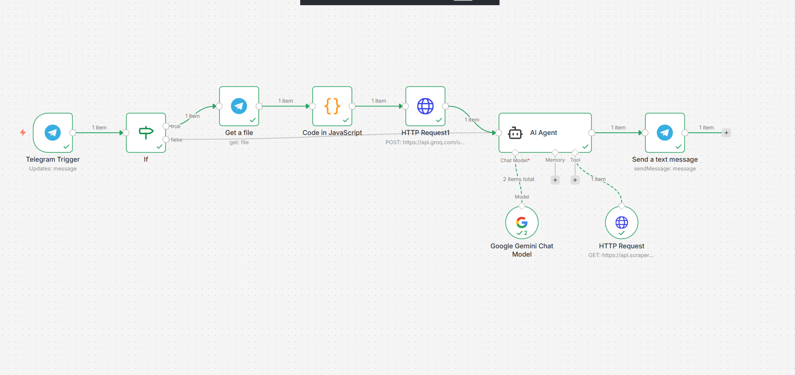

# 🛍️ AI Shop Assistant Bot (n8n)

An AI-powered Telegram shop assistant built using **n8n**, **AI agents**, and **external APIs** to intelligently process messages and files.

---

## 🚀 Overview
This project demonstrates how to design a **scalable, event-driven AI assistant** that interacts with users via chat, processes files, and responds intelligently using LLM-powered agents.

---

## 🧩 Workflow Capabilities
- 💬 Receives messages and files from Telegram
- 📂 Downloads and processes user-uploaded files
- 🧠 Uses an AI agent for intelligent reasoning
- 🔌 Integrates with external APIs for data enrichment
- 📩 Sends contextual responses back to users

---

## 🛠️ Tech Stack
- ⚙️ **n8n** – Workflow orchestration
- 🤖 **AI Agents** – Tool-augmented reasoning
- 🧪 **JavaScript** – Custom data processing
- 📡 **Telegram Bot API**
- 🌐 **REST APIs**
- 🧠 **Google Gemini Chat Model**

---

## 🗂️ Repository Structure
workflows/
└── telegram-ai-file-analysis-bot/
├── README.md
└── workflow.png

## 📸 Workflow Preview

## 🌟 Key Highlights
- 🧱 Modular and maintainable workflow design
- 🔁 Event-driven automation architecture
- 🛠️ AI agent with external tool access
- 📈 Designed with scalability in mind

---

## 🔐 Notes
> This workflow is a **sanitized and recreated version** intended solely for portfolio and demonstration purposes.  
> No proprietary data or credentials are included.

---
